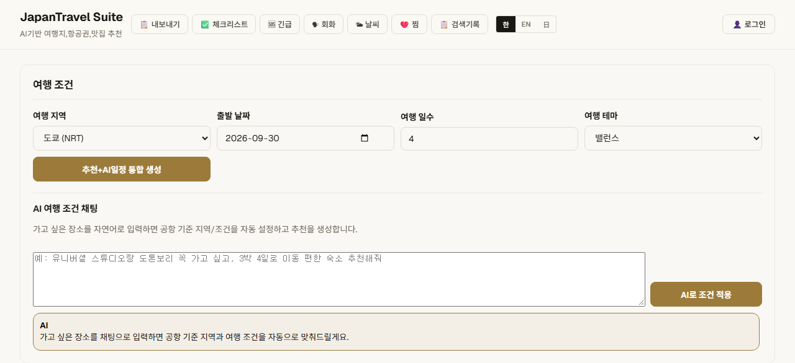
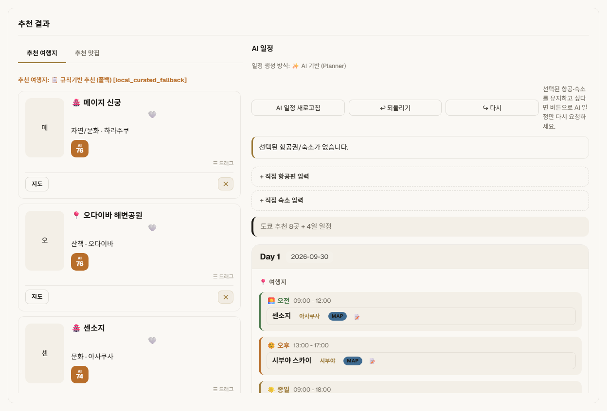
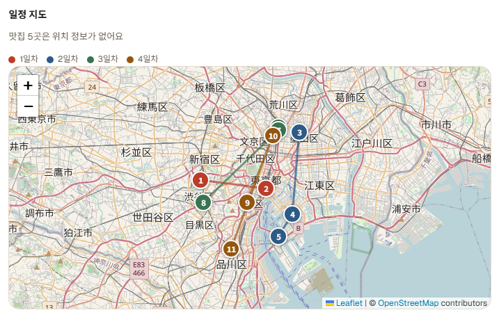
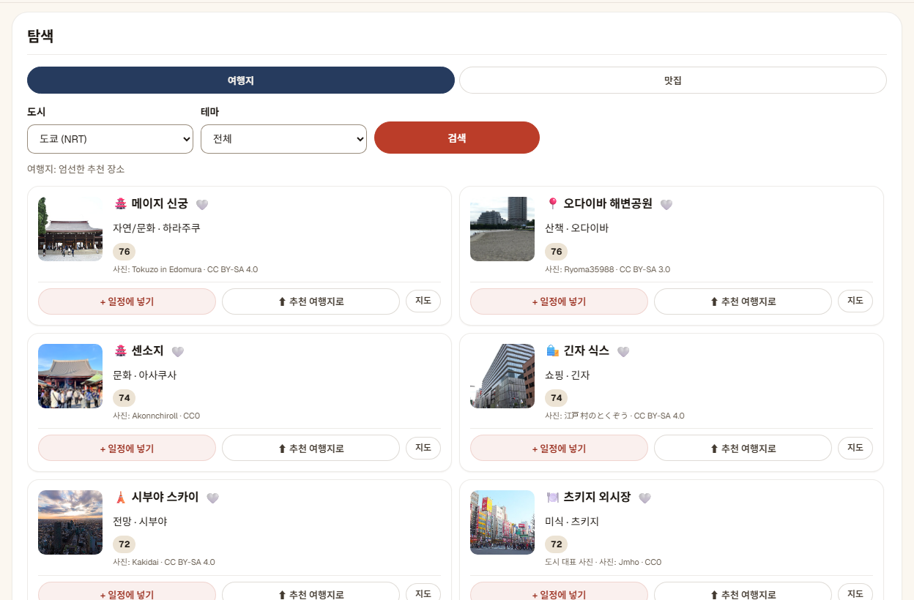
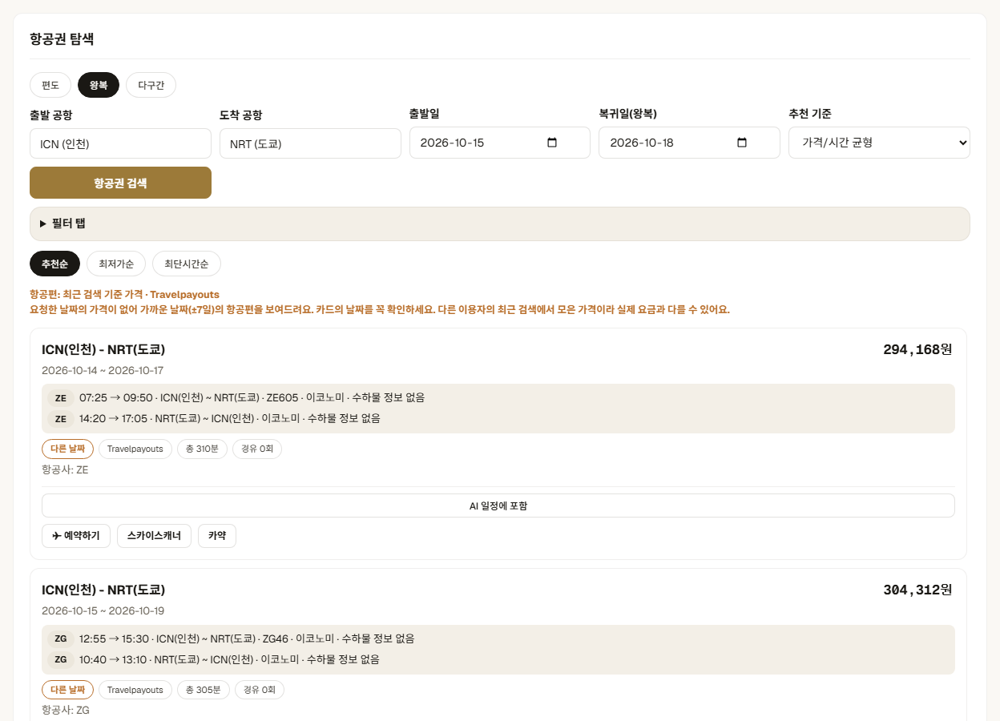
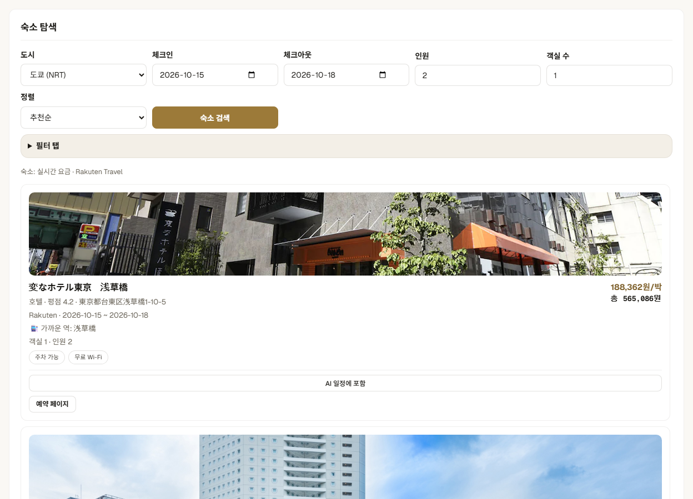

# Tabimaru — AI 일본 여행 플래너

English: **Tabimaru — AI Japan Trip Planner** · 日本語: **Tabimaru — AI日本旅行プランナー**

일본 여행 계획을 한 화면에서 만드는 웹 앱입니다. "오사카 3박 4일, 유니버셜은 꼭, 도톤보리는 빼고"처럼 말로 요청하거나 지역·날짜·일수·테마를 고른 뒤 [일정 만들기]를 누르면, 여행지 추천과 일자별 일정을 만들고 항공권·숙소·맛집·투어도 함께 찾아 줍니다. 만든 일정은 끌어 놓기나 버튼으로 직접 고칠 수 있습니다. 화면은 한국어·영어·일본어를 지원하고, 다크 모드는 기기(OS) 설정을 따릅니다.

- **운영 주소:** https://japanjapantravel.onrender.com/ (Render 무료 플랜이라 한동안 접속이 없으면 첫 로딩이 느릴 수 있습니다)
- **저장소:** https://github.com/wsxc94/tabimaru-japan-travel-planner
- **예전 이름:** JapanTravel Suite(저장소 `codex_travel-platform_project`). 이름만 바뀌었습니다. 운영 주소와 Render 서비스(`japanjapantravel`), 로그인 콜백 주소, 브라우저에 저장된 찜·메모·체크리스트는 그대로입니다. 예전 저장소 주소로 들어와도 GitHub가 새 주소로 연결해 줍니다.

## 지금 동작 방식 요약

- **기본은 무료 모드입니다.** 장소 추천은 내장 큐레이션 데이터(62개 도시)와 위키미디어 공용(Wikimedia Commons) 사진·좌표를 쓰고, 지도는 OpenStreetMap을 씁니다. Google Maps Platform은 한 번도 부르지 않으므로 요금이 생기지 않습니다.
- 무료 모드의 추천은 오류 때문에 대신 보여 주는 목록이 아니라 **정상 결과**입니다. 화면에는 "엄선한 추천 장소"로 표시됩니다.
- **사진:** 명소 카드에는 그 장소를 찍은 사진을 붙입니다. 그 장소의 사진이 없으면 도시 대표 사진을, 내장 맛집에는 음식 장르 예시 사진(라멘·스시 등)을 붙이고, 카드의 출처 줄에 "도시 대표 사진" / "음식 예시 사진"이라고 표시해 실제 장소·가게 사진으로 오해하지 않게 합니다.
- **영어·일본어 이름:** 명소 이름은 위키데이터의 영어·일본어 이름(`labels`)과 서버의 번역 표로 바꿔 보여 줍니다. 영어·일본어 화면의 카드와 일정에는 한국어가 남지 않습니다(일정 블록 앞의 시간대 표기는 화면이 번역합니다).
- 첫 화면을 여는 것만으로는 유료 API를 부르지 않습니다. [일정 만들기]를 눌렀을 때만 일정·항공·숙소·맛집을 한 번씩 조회합니다. AI 해석·AI 일정도 이 버튼(또는 [이 내용으로 만들기])을 눌렀을 때만 만듭니다.
- Google(Places·지도)은 환경변수로 다시 켤 수 있습니다. 켜더라도 결제 오류·한도 초과가 나면 30분 동안 호출을 멈추고, 하루·월 호출 수에 상한(검색 하루 30회·월 900회, 사진 하루 30회·월 900회)을 둡니다. 자세한 방법은 [Google로 다시 전환하기](#google로-다시-전환하기)를 보세요.

## 사용법

### 일정 만들기(주 버튼 하나)

1. **말로 요청하기** 칸에 원하는 여행을 씁니다. 예: "오사카 3일 교토 2일, 유니버셜은 꼭, 도톤보리는 빼고 아침 10시 이후에 시작". 비워 두고 아래 조건(도시·출발일·일수·테마)만 골라도 됩니다.
2. **[일정 만들기]**를 누릅니다.
   - 요청칸에 새 글이 있으면 먼저 그 글을 해석하고(채팅 말풍선 아래 칩으로 도시·일수·꼭 갈 곳·제외·조건을 보여 줌), 그 조건으로 일정을 만듭니다.
   - 같은 글로 다시 누르면 해석은 다시 하지 않고, 앞서 알아들은 꼭 갈 곳·제외·먹고 싶은 것을 그대로 일정 요청에 실어 보냅니다. 요청칸을 비우고 누르면 조건 칸 값만으로 만듭니다.
   - 이어서 말하면(예: "교토 하루 더 늘려줘") 앞의 대화와 해석을 이어받아 바꾼 부분만 고칩니다.
3. AI가 넣지 못한 꼭 갈 곳은 채팅에 따로 알려 줍니다. AI 사용량이 몰려 있으면(무료 한도) 기본 일정(규칙 기반)으로 만들고 "잠시 후 다시 만들어 보세요"라고 안내합니다.

### 일정 직접 고치기

| 하고 싶은 것 | 컴퓨터(마우스) | 휴대폰(터치) |
|---|---|---|
| 추천 카드를 일정에 넣기 | 카드를 원하는 칸으로 끌어다 놓기(넣을 수 있는 칸만 점선으로 강조) | 카드의 **[+ 일정에 넣기]** → 날짜·시간대 고르기, 또는 카드의 **☰ 손잡이**를 잡고 끌기 |
| 빈 칸에 장소 넣기 | 칸의 **[+ 장소 추가]** → 후보 칩을 고르거나 이름 직접 입력 | 같음 |
| 일정 항목 옮기기 | 항목을 다른 날·시간대로 끌기 | 항목의 **[옮기기]**(↔) → 날짜·시간대 고르기, 또는 **☰ 손잡이** 끌기 |
| 지우기·순서 바꾸기 | ✕ · ▲▼ | 같음(버튼이 늘 보임) |

- 여행지는 오전·오후·종일 칸에, 맛집은 아침·점심·저녁 칸에만 들어갑니다. 맞지 않는 칸에 놓으면 아무것도 바뀌지 않고 안내만 나옵니다.
- 식사 칸은 하루에 시간대마다 하나입니다. 식사를 다른 식사 칸으로 옮기면 두 식사가 자리를 바꾸고, 찬 칸에 새 맛집을 넣으면 바꿀지 먼저 묻습니다.
- 직접 고친 일정은 보호합니다. [일정 만들기]·[일정만 다시 만들기]를 누르면 덮어쓸지 먼저 묻고, 항공편·숙소를 바꿔도 일정을 자동으로 다시 만들지 않고 안내만 띄웁니다. ↩ 되돌리기로 이전 상태로 돌아갈 수 있습니다.

### 자동 보관(초안)과 저장

- 만든 일정과 고친 내용은 이 기기 브라우저에 초안 한 개로 자동 보관됩니다(localStorage `tabimaru.draft.v1`, 14일). 새로고침하거나 탭을 닫았다가 다시 열면 "저장하지 않은 일정이 있어요" 띠가 뜨고 **[이어서 편집]** / **[버리기]**를 고를 수 있습니다. 이어서 편집해도 AI를 다시 부르지 않습니다.
- 직접 고친 일정이 있는 채로 탭을 닫으면 브라우저가 한 번 묻습니다.
- 다른 기기에서도 보려면 로그인한 뒤 일정 옆의 **[💾 저장]**으로 "내 일정"에 저장합니다. 운영에서는 "내 일정"이 Supabase에 저장되어 서버가 재시작·재배포돼도 남고, 로그인(30일)도 유지됩니다. 저장소에 잠시 닿지 않으면 "저장소에 연결할 수 없어요. 잠시 후 다시 시도해 주세요."라고 알려 줍니다. **[📋 내보내기·공유]**는 글·마크다운·PDF·공유하기를 지원합니다.

### 화면 설정

- **다크 모드:** 기기(OS)의 밝게/어둡게 설정을 따릅니다(따로 켜는 버튼은 없음). 지도 타일도 어두운 톤으로 바뀝니다.
- **언어:** 머리글의 한 · EN · 日 버튼. 고른 언어는 다음 방문에도 유지됩니다.

## 화면

운영 사이트의 실제 화면입니다(2026-10-01, 무료 모드: 위키미디어 사진 + OpenStreetMap 지도, AI 일정은 Gemini). 아래 캡처는 같은 날 진행한 화면 개편(와시 크림·주홍 색, 주 버튼 하나, 일정 칸 버튼) **전에** 찍은 것이라 색·버튼 이름·배치가 지금과 조금 다릅니다. 개편을 배포한 뒤 다시 찍어 바꿀 예정입니다.

### 여행 조건 + AI 조건 채팅

지역·출발일·일수·테마를 고르고 [일정 만들기]를 누르거나, "유니버셜 스튜디오랑 도톤보리 꼭 가고 싶고 3박 4일"처럼 말로 요청하면 조건을 자동으로 채웁니다. 상단 툴바에서 내보내기·체크리스트·긴급 연락처·회화·날씨·찜·검색 기록을 쓸 수 있고, 한국어/영어/일본어로 바꿀 수 있습니다. 첫 화면을 여는 것만으로는 일정을 만들지 않습니다.

말로 한 도시 이름은 62개 도시 모두 한국어·영어·일본어로 알아듣습니다('函館で2日間', 'Kitakyushu 2 days', '카나자와'·'다카마츠' 같은 표기 변형, '나하'·'小倉'·'網走'·'会津' 같은 이웃 이름). 더 긴 이름이 먼저라 'Kitakyushu'가 '규슈'(후쿠오카)로, '기타다이토'가 '이토'(시즈오카)로 가지 않습니다. 도시 없이 장소만 말하면('다케토미섬 2일', 'Hashima Island 2 days', '高山で2日間') 그 장소가 있는 도시로 만들고, AI 해석이 데이터에 있는 장소를 '데이터 없음'으로 돌려줘도 서버가 바로잡습니다. 멀리 떨어진 두 도시(도쿄 → 삿포로)의 이동은 '대중교통 1~3시간'이 아니라 비행기 이동으로 안내합니다.



### 추천 결과: 추천 여행지 + AI 일정

추천 여행지 카드에는 위키미디어 공용 사진과 저작자·라이선스가 붙습니다. 카드는 끌어다 놓거나 [+ 일정에 넣기]로 일정에 넣을 수 있습니다([사용법](#일정-직접-고치기)). 일정은 오전·오후·종일 블록과 아침·점심·저녁 맛집 칸으로 나뉘고 항목마다 실제 시각을 보여 주며, 되돌리기/다시 실행과 경로 교통비 계산을 지원합니다. 장소가 모자란 칸은 지어낸 장소 대신 "자유 일정"으로 표시하고, 지도와 교통비 계산에서는 뺍니다.



### 일정 지도 (OpenStreetMap)

일정의 장소를 순서대로 번호 마커로 보여 줍니다. 위치 정보가 없는 장소는 지도에서 빼고 개수를 알려 줍니다.



### 탐색: 여행지·맛집



### 항공권 탐색

편도·왕복·다구간을 지원하고, 추천순·최저가순·최단시간순으로 정렬합니다. 요청한 날짜의 가격이 없으면 가까운 날짜(±7일) 항공편을 "다른 날짜"로 표시해 보여 줍니다. Skyscanner·KAYAK 링크도 제공합니다.



### 숙소 탐색 (Rakuten Travel)

실시간 요금과 숙소 사진, 가까운 역 정보를 보여 줍니다.



## 주요 기능

| 기능 | 기본(무료) | 선택 사항 / 설정이 없을 때 |
|---|---|---|
| 여행지 추천 | 내장 큐레이션 + 위키미디어 사진·좌표 (`assets/place-images.json`). 장소 사진이 없으면 도시 대표 사진 | `PLACES_PROVIDER=google`이면 Google Places(New). 실패하면 무료 데이터로 대신함 |
| 일정 생성 | 버튼을 누르면 Gemini → OpenAI 순서로 AI 일정 | AI 키가 없거나 응답이 잘리거나 형식이 틀리면 규칙 기반 일정 |
| AI 조건 채팅 | Gemini → OpenAI | 규칙 기반 해석 |
| 맛집 | 내장 큐레이션 + 음식 장르 예시 사진 | google 모드면 Google Places(New), 영업시간 표시 |
| 지도 | OpenStreetMap + Leaflet 1.9.4 | `MAP_PROVIDER=google` + 브라우저 키면 Google Maps JavaScript API |
| 항공권 | Travelpayouts 캐시 가격(요청 날짜가 비면 ±7일, 화면에 "다른 날짜" 표시) | 토큰이 없거나 결과가 없으면 "예시 데이터"로 표시 |
| 숙소 | Rakuten Travel(좌표 기반, 62개 도시). 날짜 조건 결과가 없으면 최저가 목록("날짜 미확인 최저가" 표시) | 키가 없거나 결과가 없으면 "예시 데이터"로 표시 |
| 경로 교통비 | AI 계산 또는 좌표 기반 거리 추정 | google 모드에서만 Directions API |
| 날씨 | Open-Meteo(무료, 키 없음), 모든 도시, 16일 예보(범위 밖 날짜는 안내) | 위치를 모르는 도시는 다른 도시 날씨로 대신하지 않음 |
| 환율 | open.er-api(ExchangeRate-API) → Frankfurter(무료) | `FX_USD_KRW`·`FX_JPY_KRW` 고정값 → 코드의 대략값 |
| 투어 | Klook 위젯 | 8초 안에 안 뜨면 Klook·Viator·GetYourGuide 링크 |
| 로그인 · 내 일정 | Google · Naver · Kakao OAuth. 로그인은 서명 쿠키(30일)라 서버가 재시작해도 유지 | 키가 없으면 로그인 버튼 숨김 |
| 내 일정 저장소 | Supabase(`SUPABASE_*` 설정 시, `travel_plans` 표) | 설정이 없으면 서버의 로컬 파일(`data/`, 로컬 개발용). 설정했는데 연결되지 않으면 503 |

그 밖에 일정 되돌리기/다시 실행, 편집 중 초안 자동 보관, 계절 추천, 경로 최적화, 한/영/일 다국어(키 559개), 다크 모드(OS 설정), 레이트 리밋·보안 헤더·XSS 방어가 있습니다.

## 출처 표시(폴백 투명성)

API 응답은 기존 필드(`source` 등)를 그대로 두고, 다음 정보 객체를 추가로 보냅니다. 화면은 이 값을 짧은 안내 문구(ko/en/ja)로 바꿔 보여 주고, 내부 이름이나 원시 오류 문자열은 보여 주지 않습니다.

- `POST /api/travel-plan` → `recommendationInfo`, `itineraryInfo`, `foodsInfo`
- `POST /api/ai-travel-chat`, `POST /api/destinations`, `POST /api/dest-search`, `GET /api/foods`, `POST /api/flights`, `POST /api/stays` → `sourceInfo`
- `itineraryInfo`에는 AI 일정 후처리 결과 `postProcess`(고친 블록 수 8가지)와 넣지 못한 꼭 갈 곳 `missingMustVisit`도 붙습니다([ARCHITECTURE.md 6.4](ARCHITECTURE.md#64-의도-계약)).

모양: `{ kind, provider, reasonCode }`

| kind | 뜻 | 화면 문구 예(ko) |
|---|---|---|
| `curated` | 무료 모드의 정상 결과(내장 큐레이션 + 위키미디어) | 엄선한 추천 장소 |
| `live` | 실시간 공급자 결과(Google Places, Travelpayouts, Rakuten) | 실시간 정보 |
| `ai` | AI가 만든 일정 | AI가 만든 일정 |
| `rule` | 규칙 기반 일정 | 기본 일정 (규칙 기반) |
| `fallback` | 공급자 실패로 무료 데이터를 대신 씀(숙소는 날짜 조건 없는 최저가 목록) | 기본 목록 |
| `mock` | 실제 가격이 아닌 예시 데이터 | 예시 데이터 |

`reasonCode`는 대체한 이유입니다: `GOOGLE_KEY_MISSING`, `GOOGLE_BILLING_DISABLED`, `GOOGLE_PERMISSION_DENIED`, `GOOGLE_QUOTA_EXCEEDED`, `GOOGLE_ERROR`, `GOOGLE_CIRCUIT_OPEN`, `NO_RESULTS`, `AI_KEY_MISSING`, `AI_TRUNCATED`, `AI_INVALID_OUTPUT`, `AI_ERROR`, `AI_BUSY`(Gemini 429 한도·503 과부하: 잠시 후 다시 시도), `PROVIDER_UNAVAILABLE`, `NO_LIVE_DATA`, `NO_GENRE_MATCH`(`/api/foods`에서 그 장르의 가게가 없어 빈 목록). 무료 모드의 정상 결과는 `reasonCode: null`입니다. AI가 응답했어도 쓸 만한 값이 하나도 없으면 `ai`로 표시하지 않습니다(`rule` + `AI_INVALID_OUTPUT`). 서버는 실제 공급자 오류(HTTP 상태·사유, 비밀값 제외)를 같은 사유당 10분에 한 번만 로그로 남깁니다. 응답의 `aiErrors`에는 `{ provider, code, reasonCode, action }`만 담고, 공급자 원문 메시지는 서버 로그에만 남깁니다.

카드 사진에는 `photoCredit: { artist, license, filePage, scope }`가 붙습니다. `scope`는 사진이 무엇을 찍은 것인지 알려 줍니다.

| scope | 뜻 | 화면 표시(ko / en / ja) |
|---|---|---|
| `place` | 그 장소 자체의 사진(위키미디어, google 모드에서는 Google 사진) | 표시 없음 |
| `city` | 장소 사진이 없어 붙인 도시 대표 사진. 좌표는 붙이지 않음 | 도시 대표 사진 / City photo / 都市の写真 |
| `genre` | 내장 맛집에 붙인 음식 장르 예시 사진(그 가게 사진이 아님) | 음식 예시 사진 / Example photo / 料理のイメージ |

## 사진 데이터 범위와 한계

`assets/place-images.json`(버전 1)은 `scripts/build-place-images.js`(`npm run build:place-images`)가 키 없이 Wikipedia·Wikidata(P18)·Commons API로 만듭니다. 서버는 시작할 때 이 파일을 한 번 읽고, 실행 중에는 위키미디어를 부르지 않습니다.

| 칸 | 범위(2026-10-01 기준) | 설명 |
|---|---|---|
| `places` | 명소 195곳: 사진 185곳, 좌표 192곳, 영어 이름 193곳, 일본어 이름 195곳 | 키는 `<도시 키>\|<명소 이름>`. 영어 이름이 없는 2곳(하나마키 온천, 와쇼 시장)은 서버 번역 표로 채움 |
| `cities` | 62개 도시 중 58곳 | 도시(섬) 항목의 대표 사진. 이름으로 찾지 못한 곳과 사진이 부적절한 곳은 공항 근처 항목을 직접 지정 |
| `foodGenres` | 음식 장르 23개(내장 맛집 250곳 중 228곳 해당) | 장르별 대표 음식 사진(파일 이름 고정) |

사진을 고르는 규칙:

- Commons의 자유 라이선스 이미지(CC BY, CC BY-SA, CC0, 퍼블릭 도메인)만 씁니다. 위키백과 로컬(비자유) 이미지와 GFDL 단독 라이선스 이미지는 쓰지 않습니다.
- **온천·목욕 사진은 입욕객이 보이지 않는 사진만 씁니다.** 이름이나 사진 파일에 온천·노천탕·모래찜 같은 말이 들어간 사진은 `node scripts/build-place-images.js --review-baths`로 모두 내려받아 눈으로 확인합니다. 입욕객이 보이면 관련 항목의 사진으로 바꿉니다(예: 유후인은 무소엔 노천탕 사진 대신 긴린코 호수 사진).
- 도시 사진 중 시청·호텔 건물처럼 도시를 대표하지 않는 사진은 뺐습니다.
- `server.js`의 명소 이름을 바꾸면 이 파일도 다시 만들어야 합니다.

남은 한계:

- 사진이 없는 명소 10곳과 데이터가 없는 명소(설명형 이름이나 위키 문서가 없는 곳, 예: 미야자와 겐지 기념관, 아야마루 곶, 무시로세 해안)는 도시 대표 사진으로 대신하고, 도시 사진도 없으면 글자 타일로 보입니다.
- 도시 사진이 없는 도시: 아키타(akita), 오다테(odate), 오카야마(okayama), 사가(saga). 시청·호텔 사진뿐이라 뺐습니다.
- 예시 사진이 없는 음식 장르: 향토요리, 쿠시카츠, 분식, 구이, 패스트푸드, 샐러드, 유제품(맛집 22곳). 이 맛집은 사진 없이 보입니다.
- 영어·일본어 이름은 위키데이터 항목 이름이라 카드가 말하는 대상과 조금 다를 수 있습니다(예: "하코다테 야경" → Mount Hakodate). 어색한 이름은 서버의 번역 표(`CURATED_PLACE_I18N`)에서 고칩니다.
- google 모드에서 Google 결과 맛집에 사진이 없으면 음식 장르 사진으로 채우지 않습니다(내장 맛집에만 붙임).

## 도시 주변 실제 명소 데이터 (`assets/city-places.json`)

내장 큐레이션 명소는 도시마다 3~6곳뿐이라, 3~4일 일정이 '자유 일정'으로 채워지던 도시가 많았습니다. `assets/city-places.json`(버전 1)은 `scripts/build-city-places.js`(`npm run build:city-places`)가 키 없이 Wikidata(장소·좌표·이름, CC0)와 Commons(사진)로 만든, 도시 주변의 실제 명소 목록입니다. 서버는 시작할 때 한 번 읽고, 실행 중에는 위키미디어를 부르지 않습니다.

- 범위(2026-10-02 기준): 도시 주변 명소 511곳(62개 도시 중 60곳), 사진 461곳, 한국어 이름 511곳 모두(아래 '이름'). `media` 25곳. `few` 6곳(리시리·다네가시마·시모지시마·구메지마·기타다이토·도쿠노시마).
- **큐레이션이 먼저입니다.** 도시의 반나절 명소(도시 명소 + 대표 명소 + 추가 명소)가 12곳이 될 때까지만 채우고, 도시 명소 풀에서는 늘 맨 뒤에 둡니다. 도쿄·교토처럼 이미 충분한 도시는 채우지 않습니다.
- **실제 장소만 씁니다.** 모든 항목에 위키데이터 QID와 좌표가 있고, 도시 중심(`CITY_CENTER_COORDS`)에서 정한 반경(대도시 12~15km, 보통 20km, 섬은 섬 크기) 안의 절·신사·성·박물관·미술관·공원·정원·전망대·온천·수족관·시장·명승·유적만 고릅니다. 역·학교·행정구역·강·국립공원처럼 한 곳을 가리키지 않는 항목, 도시가 있는 섬 자체는 뺍니다. 순서는 위키데이터에서 많이 다룬 순(사이트링크 수, 한국어 이름이 있으면 가산)이고, 같은 종류가 몰리지 않게 종류마다 상한을 둡니다.
- 규칙 일정과 AI 일정은 이 목록과 큐레이션 데이터 안에서만 장소를 고릅니다(지어낸 장소 없음). 다른 도시의 장소로 빈칸을 채우지 않습니다.
- **이름**: 한국어 이름은 눈으로 확인한 이름(`nameFrom: "fix"`, 외래어·긴 기관 이름: 스크립트의 `NAME_FIXES`) → 한국어 위키백과 제목(`kowiki`, 위키데이터 한국어 이름이 틀린 곳이 있어 먼저 봄) → 위키데이터 한국어 이름(`ko`) → 일본어 이름을 국립국어원 일본어 표기법으로 옮긴 이름(`translit`, `scripts/ja-names.js`: 가나 읽기(P1814)나 헵번식 영어 이름에서 '霊山神社 → 료젠 신사', 'Mount Shinobu → 시노부산', 'Kamabuchi Falls → 가마부치 폭포') 순입니다. 일본어로만 남은 이름은 없습니다(AI가 일본어 후보 이름을 번역·음역해 엉뚱한 이름을 쓰던 원인). 영어 이름이 없는 곳은 가나 읽기의 헵번식('Dai Onsen')을 씁니다.
- **이름이 겹치는 곳**: 다른 도시의 유명한 곳과 같은 이름(구시로의 厳島神社, 하나마키의 清水寺)이나 위키데이터가 구분 괄호를 붙인 이름(福山城 (備中国))은 도시 이름을 앞에 붙입니다('구시로 이쓰쿠시마 신사' / '釧路厳島神社' / 'Kushiro Itsukushima Shrine'). 채팅은 이런 이름과 두 도시 이상에 있는 이름, 'Toro' 같은 짧은 로마자 이름으로는 장소를 찾지 않습니다.
- **검토로 뺀 곳**(`EXCLUDE_QIDS`): 닫은 미술관(도야마 현립 근대미술관, 2016), 상륙할 수 없는 바위섬(소야곶 앞 벤텐섬·히라섬, 다나베 神島, 甲島), 주거 섬(히코섬·시마다섬), 스키 점프대, 도로 고개 2곳, 센카쿠 신사, 이름 없는 산. 같은 곳 중복(성과 그 성터 공원, 섬과 그 등대, 공원 안 미술관)은 하나로 합칩니다.
- **사진**: 자유 라이선스 Commons 사진만, 저작자·라이선스·파일 페이지와 함께 씁니다(사진 데이터와 같은 규칙). 온천·목욕 사진은 눈으로 확인한 파일(`REVIEWED_BATH_FILES`)만 쓰고 나머지는 빼 둡니다.
- **`few`**: 주변에 반나절 명소가 9곳보다 적은 작은 섬은 `few: true`입니다. 일정 팁 맨 앞에 "명소가 N곳뿐이라 남는 시간은 자유 일정으로 두었다"고 알립니다.
- **`media`**: 사진 데이터(`place-images.json`)에 없는 큐레이션 이름(공항 없는 인기 여행지의 당일치기 대표 명소 등)의 사진·좌표·영어/일본어 이름입니다. 항목마다 스크립트의 `MEDIA_ITEMS`에 확인한 위키데이터 항목을 적어 둡니다.
- 공항이 없는 인기 여행지(닛코·가루이자와·가와구치코/후지산·다카야마·이세 신궁·히메지성·뵤도인(우지)·아마노하시다테·고야산·나오시마(지추 미술관)·구로카와 온천·젠코지(나가노))는 가까운 도시의 당일치기 대표 명소(`MUST_ATTRACTIONS`)로 두어, '닛코 2일'이라고 하면 도쿄 + 닛코 당일치기가 됩니다. 구마노고도는 고베가 아니라 난키 시라하마의 당일치기(구마노 혼구 다이샤)입니다.

## Google로 다시 전환하기

Google Maps Platform은 **결제 계정이 연결된 프로젝트에서만** 동작합니다. 예전 운영에서는 무료 체험이 끝나 결제가 꺼진 상태였고, Text Search 하루 할당량(100건)도 테스트와 방문으로 금방 소진되어 사진 없는 대체 목록만 나왔습니다. 다시 켤 때는 아래 순서를 지키세요.

1. **예전 키 폐기.** 예전 `GOOGLE_MAPS_API_KEY`는 `/api/maps-config`와 사진 주소를 통해 브라우저에 공개된 적이 있습니다. 새 키를 만들고 예전 키는 삭제합니다.
2. **결제와 예산 알림.** Google Cloud 콘솔 → 결제에서 프로젝트에 결제 계정을 연결하고, "예산 및 알림"에서 월 예산 알림을 만듭니다. 예산 알림은 알려 주기만 하고 사용을 멈추지는 않으니, 3번의 할당량 상한과 함께 씁니다.
3. **콘솔 할당량 상한(가장 중요).** API 및 서비스 → 사용 설정된 API → 각 API → 할당량에서 하루 요청 수 상한을 낮춰 둡니다: Places API (New)(Text Search, Place Photos), Geocoding API, Directions API, 지도를 바꾸면 Maps JavaScript API. **서버의 상한 카운터는 메모리에 있어서 서버가 재시작하면 0부터 다시 셉니다.** Render 무료 플랜은 자주 재시작하므로, 요금을 확실히 막는 장치는 콘솔 할당량입니다.
4. **SKU별 월 무료 사용량 확인.** 2025년 3월부터 Google Maps Platform은 SKU마다 월 무료 사용량이 따로 있고, 한 요청은 요청한 필드 중 가장 비싼 SKU로 계산됩니다. 2026-10-01에 가격표에서 확인한 값은 아래와 같습니다. 켜기 전에 [가격표](https://developers.google.com/maps/billing-and-pricing/pricing)에서 다시 확인하세요.

   | 이 앱의 호출 | SKU | 월 무료 사용량 |
   |---|---|---|
   | 명소·맛집 검색(Text Search). 필드 마스크에 `rating`·`userRatingCount`·`priceLevel`·`currentOpeningHours`가 있어 Enterprise로 계산됨 | Text Search Enterprise | 1,000건 |
   | 카드 사진(`/api/place-photo`) | Place Details Photos | 1,000건 |
   | 진단 probe(필드 마스크 `places.id`만) | Text Search Essentials (IDs Only) | 제한 없음 |
   | 모르는 지역의 좌표 | Geocoding | 10,000건 |
   | 경로 교통비 | Directions | 10,000건 |
   | 지도(`MAP_PROVIDER=google`, 브라우저에서 호출) | Dynamic Maps | 10,000건 |

   서버 기본 상한(검색 하루 30회·월 900회, 사진 하루 30회·월 900회)은 1,000건 무료 사용량보다 낮게 잡은 값입니다. 검색 상한에는 Geocoding·Directions 호출도 들어가고, 사진은 따로 셉니다. 브라우저의 Maps JavaScript API 호출은 서버 상한 밖이라 콘솔 할당량으로만 막힙니다.
5. **키 두 개로 분리.**
   - 서버 키 `GOOGLE_MAPS_SERVER_KEY`: API 제한 = Places API (New), Geocoding API, Directions API. 서버에서 호출하므로 **HTTP 리퍼러 제한을 걸면 안 됩니다**(모든 호출이 거부됨). 애플리케이션 제한은 없음 또는 Render 아웃바운드 IP로 둡니다. 이 키는 브라우저로 절대 나가지 않습니다(사진도 `/api/place-photo` 프록시로 전달).
   - 브라우저 키 `GOOGLE_MAPS_BROWSER_KEY`(지도를 Google로 바꿀 때만): 애플리케이션 제한 = HTTP 리퍼러(`https://japanjapantravel.onrender.com/*`, 개발용 `http://localhost:3000/*`), API 제한 = Maps JavaScript API. 좌표가 없는 장소를 브라우저에서 찾게 하려면 Geocoding API도 허용합니다.
6. **Render 환경변수.** `PLACES_PROVIDER=google`, `GOOGLE_MAPS_SERVER_KEY`. 상한을 바꾸려면 `GOOGLE_DAILY_CALL_LIMIT`, `GOOGLE_MONTHLY_CALL_LIMIT`, `GOOGLE_PHOTO_DAILY_LIMIT`, `GOOGLE_PHOTO_MONTHLY_LIMIT`. 지도까지 Google로 바꾸려면 `MAP_PROVIDER=google`, `GOOGLE_MAPS_BROWSER_KEY`. 진단용으로 `DIAGNOSTICS_TOKEN`(긴 무작위 문자열)을 넣습니다.
7. **확인.** `GET /api/health`의 `providers`가 `{ "places": "google" }`인지 보고, `GET /api/ai-diagnostics`의 `google.circuitOpen`, `lastErrorCode`, `callsToday`·`callsThisMonth`, `photoCallsToday`·`photoCallsThisMonth`를 확인합니다. 실제 호출로 확인하려면 `curl -H "x-diagnostics-token: <토큰>" "https://…/api/ai-diagnostics?probe=1"`(Places 1회 호출)을 씁니다.
8. **되돌리기.** `PLACES_PROVIDER`를 지우거나 `free`로, `MAP_PROVIDER`를 지우거나 `osm`으로 바꾸면 즉시 무료 모드로 돌아갑니다.

그 밖의 참고:

- google 모드의 서버 보호 장치: 결제 꺼짐·권한 거부·할당량 초과 응답을 받으면 30분 동안 모든 Google 호출을 건너뜀, 하루·월 호출 상한(UTC 기준), 결과 캐시 12시간, 사진 캐시(서버 메모리 최대 200장·30MB·24시간, 브라우저 캐시 1일). 일정 생성 1회에 Text Search가 최대 4건(명소 2 + 맛집 2) 나가고, 같은 조건이 캐시에 있으면 0건입니다.
- 결과를 12시간 캐시하는 것이 Google Maps Platform 약관의 캐시 제한과 맞는지는 아직 확인하지 않았습니다. 켜기 전에 약관을 확인하세요.

## Groq 무료 연결 (AI 한도 늘리기)

Gemini 무료 한도는 모델마다 하루 약 20회이고 키가 아니라 프로젝트 단위라서, 키를 더 만들어도 늘지 않습니다. Groq 무료(카드 불필요)를 OpenAI 호환 경로에 연결하면 채팅 해석은 Groq가 맡고, Gemini 한도는 일정 생성에 남습니다. Gemini 한도를 다 써도 일정은 Groq가 만듭니다.

1. [console.groq.com](https://console.groq.com)에 가입하고 API Keys에서 `gsk_`로 시작하는 키를 만듭니다. 결제 수단은 필요 없습니다.
2. Render 환경변수에 넣습니다. Groq 키는 `OPENAI_API_KEY`가 아니라 **`GROQ_API_KEY`**에 넣습니다(서버는 Groq 키를 Groq 주소에만 보냅니다).
   ```
   GROQ_API_KEY=gsk_...
   OPENAI_BASE_URL=https://api.groq.com/openai/v1
   OPENAI_MODEL=openai/gpt-oss-120b
   OPENAI_FALLBACK_MODELS=openai/gpt-oss-20b,qwen/qwen3.8-27b
   OPENAI_MAX_OUTPUT_TOKENS=3500
   OPENAI_REASONING_EFFORT=low
   AI_CHAT_PROVIDER_ORDER=openai,gemini
   ```
   `qwen/qwen3.8-27b`는 Groq의 미리보기 모델(예고 없이 종료될 수 있음)이라 맨 뒤에 둡니다. `OPENAI_MAX_OUTPUT_TOKENS`는 Groq 무료의 분당 8천 토큰 한도보다 작게 잡은 값입니다. `OPENAI_API_KEY`가 비어 있으면 `OPENAI_BASE_URL`·`OPENAI_MODEL`은 생략해도 Groq 주소·`openai/gpt-oss-120b`가 됩니다.
3. 확인: `GET /api/health`의 `ai.openaiProvider`가 `Groq`, `ai.openaiKeySource`가 `GROQ_API_KEY`, `ai.openaiModelChain`이 위 순서, `ai.chatProviderOrder`가 `["openai","gemini"]`인지 봅니다. 채팅 해석 응답의 `source`가 `openai_chat_parser_v1`이고 `aiModel`이 Groq 모델 이름이면 Groq가 해석한 것입니다.
4. 되돌리기: `AI_CHAT_PROVIDER_ORDER`를 지우면 채팅 해석이 다시 Gemini 먼저입니다. `GROQ_API_KEY`를 지우면 Groq를 쓰지 않습니다.

- 한도(2026-10-02 공식 문서 기준, 모델마다): 분당 30회, 하루 1,000회, 분당 8천 토큰, 하루 20만 토큰. 하루 토큰 한도가 먼저 차며, 채팅 해석(약 3.6천 토큰)과 일정(약 7천 토큰)을 함께 쓰면 모델 하나로 하루 약 18회입니다.
- 일정 생성은 늘 Gemini가 먼저이고, Gemini가 실패하면 Groq가 만듭니다. Groq 품질이 충분한지는 같은 요청으로 비교해 본 뒤에 순서를 바꾸세요.
- Groq는 입력을 기본으로 보관하지 않고, 악용 조사 목적으로만 최대 30일 보관합니다. 보관을 완전히 끄는 설정(ZDR)은 콘솔에서 고를 수 있습니다.

## 데이터 출처와 저작자 표시

| 출처 | 쓰는 곳 | 라이선스·조건 | 화면 표기 |
|---|---|---|---|
| [Wikimedia Commons](https://commons.wikimedia.org/) | 명소·도시·음식 장르 사진 | 사진마다 다름(CC BY, CC BY-SA, CC0, 퍼블릭 도메인). CC BY-SA는 저작자·라이선스·출처 링크 표기 필요 | 카드마다 "사진: 저작자 · 라이선스"를 파일 페이지 링크와 함께 표시(도시·음식 사진은 앞에 종류 표시) |
| [Wikidata](https://www.wikidata.org/) | 명소 좌표, 영어·일본어 이름 | CC0(표기 의무 없음) | — |
| [OpenStreetMap](https://www.openstreetmap.org/copyright) | 지도 타일(`tile.openstreetmap.org`) | 지도 데이터 ODbL. OSM 재단 타일 사용 정책상 트래픽이 많아지면 별도 타일 제공자로 옮겨야 함 | 지도 오른쪽 아래 "© OpenStreetMap contributors" |
| [Leaflet](https://leafletjs.com/) 1.9.4 | 지도 라이브러리(unpkg, SRI 검증) | BSD-2-Clause | 지도 표기에 포함 |
| [Open-Meteo](https://open-meteo.com/) | 날씨 예보, 무료 지오코딩 | 데이터 CC BY 4.0(출처 표기 필요). 무료 API는 **비상업적 사용** 조건(하루 10,000회 이하) | 날씨 위젯·날씨 패널 하단에 "Weather data by Open-Meteo.com" 링크(ko/en/ja) |
| [ExchangeRate-API](https://www.exchangerate-api.com/) (`open.er-api.com`) | 환율(1순위) | 공개 엔드포인트는 출처 표기 필요, 하루 1회 갱신, 받은 환율을 다른 곳에 다시 배포하는 것은 금지 | 환율 칩 안에 "Rates By Exchange Rate API" 링크(ko/en/ja) |
| Frankfurter (`api.frankfurter.dev/v2`, `providers=ecb`) | 환율(2순위) | 유럽중앙은행(ECB) 기준 환율만 받음(v2 기본값은 여러 기관 값을 섞어서 ECB로 고정), 표기 의무 없음 | — |
| [Rakuten Web Service](https://webservice.rakuten.co.jp/guide/credit) | 숙소(Rakuten Travel) | API를 쓰는 앱은 크레딧 배지 필수, 제공된 HTML을 고치지 말 것(어기면 API 사용이 막힐 수 있음) | 숙소 결과 아래 "Supported by Rakuten Developers" 링크(제공 HTML 그대로) |
| Travelpayouts(Aviasales), Rakuten Travel | 항공 캐시 가격, 숙소 | 각 제휴 약관 | 예시 데이터에는 "예시" 표시가 붙고 일정에 넣을 수 없음 |

- 서버가 무료 공개 API(Open-Meteo, 환율)를 부를 때는 `User-Agent: TabimaruBot/0.1 (+https://github.com/wsxc94/tabimaru-japan-travel-planner)`을 보냅니다. 날씨는 좌표별 30분, 환율은 12시간 동안 캐시합니다.
- Open-Meteo 무료 API는 비상업적 사용 조건입니다. 제휴 링크(Travelpayouts·Klook) 수익이 생기면 상업적 사용으로 볼 수 있으니 약관을 다시 확인하고, 필요하면 유료 요금제로 바꾸세요.

## 로컬 실행

요구사항: **Node.js 20 이상**(전역 `fetch` 사용). 외부 패키지가 없어서 `npm install`은 필요 없습니다.

```powershell
git clone https://github.com/wsxc94/tabimaru-japan-travel-planner.git
cd tabimaru-japan-travel-planner
copy .env.example .env    # 필요한 값만 채웁니다. 비워 두면 무료 모드와 예시 데이터로 동작합니다.
node server.js            # 또는 npm start
```

브라우저에서 `http://localhost:3000`을 엽니다. 포트를 바꾸려면 `PORT`를 씁니다. `server.js`는 저장소 루트의 `.env`를 직접 읽고, 셸에 이미 있는 환경변수가 `.env`보다 우선합니다.

## 테스트

```powershell
npm test                  # = node test_all.js
```

- 실제 네트워크를 쓰지 않습니다. 서버를 벤더 키가 모두 빈 상태로 띄우고(`.env` 값은 쓰지 않음), Google·Gemini·Travelpayouts 주소를 테스트가 띄운 가짜 서버(포트 3205)로 돌립니다. 환율·날씨 같은 그 밖의 외부 호출은 `tests/support/net-guard.js`가 가짜 서버로 보냅니다.
- 서버(포트 13581)를 설정만 바꿔 스무 번 띄웁니다: 무료 모드(기본), 무료 모드 사진·영어/일본어 이름, 프록시 신뢰(모든 도시 날씨·X-Forwarded-For 위조), Google 결제 꺼짐(대체 목록 + 30분 차단), Google 정상(사진 프록시·Gemini 잘림/정상/빈 일정·Travelpayouts), 하루 호출 상한, Geocoding 거부, OAuth 로그인 state·AI 오류 원문 제거, 로그인 세션·내 일정 저장소(10번: 가짜 Supabase 정상·재시작·비밀값 교체·503·틀린 키 401·연결 거부·파일 저장소·로그인 허용 목록·약한 비밀값 2가지), 의도 회귀 표, AI 일정 후처리. 서버의 `users.json`·`saved_plans.json`은 늘 임시 폴더(`TABIMARU_DATA_DIR`)에만 쓰이고, 저장소의 `data/` 폴더가 그대로인지도 마지막에 확인합니다.
- **로그인 세션·내 일정:** 가짜 OAuth로 로그인을 끝까지 해서 `sid` 쿠키 모양(`base64url(JSON).HMAC`, HttpOnly·SameSite=Lax·Path=/·30일), 고정 사용자 id(같은 계정 = 같은 id, 공급자별로 다름), 위조·변조·다른 비밀값·만료·너무 긴 쿠키·깨진 base64/JSON·예전 형식·`xsid=` 미끼 21가지, 같은 `SESSION_SECRET`으로 재시작해도 로그인 유지(바꾸면 로그아웃)를 봅니다. 내 일정은 가짜 Supabase(PostgREST)로 저장·목록·불러오기·삭제, 행 대응(`plan_key = 'my_' + id`, `source = 'my-plans'` 등), 다른 사용자가 보거나 덮어쓰거나 지우지 못함, `sb_secret_` 키는 `apikey`만·`eyJ…` 키는 Bearer도, Supabase 503·연결 거부 → 503 `PROVIDER_UNAVAILABLE`이고 파일에 쓰지 않음, 설정이 없으면 파일 저장소, `/api/health`의 참·거짓 값, `/api/keepalive` 캐시(성공 10분·실패 15초)를 확인합니다. 이어서 개인 일정 응답의 `Cache-Control: no-store`, NUL·짝 없는 서로게이트 정리(저장 200), 400KB 넘는 일정 413, 사용자당 50개 상한 409(덮어쓰기는 허용, 목록 50개), 저장소가 내용을 거절하면 400 `INVALID_PLAN`(저장소 상태는 정상 그대로), 틀린 키(401) → health `supabaseReachable: false`·`supabaseCheck: "auth_error"`, `ALLOWED_LOGINS` 밖 계정 → `/?authError=not_allowed`(sid 없음, 목록을 바꾸면 예전 sid 끊김), 약한 `SESSION_SECRET`은 쓰지 않음(그 값으로 위조한 sid 거절)을 봅니다. 화면 쪽은 `/api/auth/me` 502 한 번 → 다시 물어 로그인 화면 유지, 저장소 503 → "저장소에 연결할 수 없어요", 409·413·400 → 각 안내, `authError=not_allowed` → 허용 계정 안내를 샌드박스로 봅니다.
- **의도 회귀 표(말로 한 요청을 제대로 알아듣는지):** 실제 Gemini로 돌려 본 요청(ai_live P01-P16·X1-X3), 코드 검수 요청(ai_code P01-P19), 정규식 보정 사례(SV-04)를 합친 58줄을 가짜 Gemini 400으로 규칙 해석기에 보내고, 일수·출발일(월·일, 올해/내년)·도시·테마·쇼핑 제외·꼭 갈 곳·제외·미지원 지역·도착/출발/시작 시각·하루 장소 수를 확인합니다. 줄 이름에 감사 ID와 요청이 붙고, 틀리면 어느 필드가 무엇이었는지 한 줄로 보입니다. 이어서 Gemini 해석 정규화(정직한 `sourceInfo`, '쇼핑은 빼줘'인데 테마 shopping 거부, 폼 도시보다 메시지의 도시), 영어·일본어 답변에 한국어가 남지 않는지, 후속 대화("교토 하루 더 늘려줘")를 봅니다.
- **AI 일정:** 가짜 Gemini가 계약을 어긴 일정(저녁 칸의 관광, 오후 칸의 맛집, 반나절 칸의 USJ, 빠진 꼭 갈 곳, 매일 같은 점심, 지어낸 장소, 제외한 디즈니)을 돌려줘도 서버 후처리가 고치는지, 프롬프트에 요청 원문·꼭 갈 곳·도시별 날짜·`Constraints:`가 들어가는지, 429·503이 `AI_BUSY`가 되는지 봅니다.
- **직접 배치(샌드박스):** `placeBlock`(식사 맞바꾸기·같은 식사 칸 2개 금지·오전 순서·종류가 다르면 그대로, '🌙 저녁 이후' 칸 항목을 같은 날·다른 날 오후 칸으로 옮기면 오후 시각으로, 바뀔 것이 없으면 `place-noop` 안내, 추가 창의 '저녁 이후' 선택지), 추가 창(직접 입력 뒤 카드 추가·강조된 시간대 = 들어간 시간대·[옮기기]), 끌어 놓기 공용 경로와 ☰ 손잡이 터치 끌기, 직접 고친 일정 보호, 요청 의도 전달(`request`·`mustVisit`·`excludedPlaces`·`foodWishes`·`history`·`prevParsed`), 설정 안 된 로그인 버튼 숨김, 초안 복구(유료 호출 0회)를 봅니다.
- 보안 회귀 검사: 네이버·카카오·Google 로그인 시작 응답의 `oauth_state` 쿠키(HttpOnly, SameSite=Lax, Path=/api/auth, 10분) 값이 이동 주소의 `state`와 같은지 봅니다. 콜백에 쿠키가 없거나, 다른 쿠키이거나, `state`가 없거나, 다른 공급자의 `state`이거나, 한 번 통과한 `state`를 다시 보내면 모두 `/?authError=invalid_state`로 가는지도 봅니다. 토큰 교환은 가짜 서버가 거절하므로 실제 로그인이나 사용자 저장은 일어나지 않습니다. Gemini가 400과 오류 원문을 돌려줘도 `travel-plan`·`ai-travel-chat` 응답의 `aiErrors`에는 `provider`·`code`·`reasonCode`·`action`만 있고 원문은 없어야 합니다.
- 사진 검사: 도시 대표 사진(`scope: city`, 도시 좌표는 붙이지 않음)과 음식 장르 사진(`scope: genre`)이 Commons 주소·저작자·라이선스와 함께 붙는지, 사진 종류마다 `place-images.json`의 맞는 칸과 같은지, 예시 사진이 없는 장르는 비워 두는지 봅니다.
- 이름 검사: 영어·일본어 응답의 카드 이름이 `labels`를 쓰는지, 카드·맛집·일정 글자에 한국어가 남지 않는지, 현지화된 이름으로도 지도 좌표를 찾는지 봅니다.
- 브랜드 검사: `/api/health`의 `app`이 `tabimaru`, 페이지 제목·매니페스트 이름이 Tabimaru인지, 언어를 바꾸면 제목도 바뀌는지, 외부 호출의 User-Agent가 `TabimaruBot/0.1`인지 봅니다. 도메인에 묶인 값(운영 주소, Render 서비스 이름, OAuth 콜백 경로, `sid` 쿠키, localStorage 키, 매니페스트 `start_url`)이 그대로인지도 봅니다.
- 첫 화면은 `tests/support/browser-sandbox.js`로 `app.js`를 실제로 부팅해, 유료 API를 부르지 않는지 확인합니다. 이어서 [일정 만들기]를 두 번 눌러도 일정 1회 + 항공·맛집·숙소 각 1회만 부르는지, 카드에 실제 ``와 위키미디어 출처가 붙는지, Leaflet이 일정이 생긴 뒤에만 SRI와 함께 로드되는지, 빈 일정에 안내 문구가 나오는지도 봅니다. 사진·출처 표시 함수(`safeImageUrl`·`safeCreditUrl`·`cardPhoto`·`photoCreditHtml`)와 추천·맛집 카드에는 악성 값(`javascript:`·`data:` 주소, 비슷한 호스트, `/\`·`//` 우회 주소, 따옴표·HTML이 든 이름과 저작자)을 넣습니다. 그래도 사진은 Commons나 `/api/place-photo`, 출처 링크는 Commons 파일 페이지나 Google 기여자 페이지만 남고, 나머지 값은 모두 이스케이프되는지 봅니다.
- 그 밖에 응답에 키가 섞이지 않는지, 날씨 응답이 날짜·숫자만 담는지, CSRF 출처 검사, 긴급 전화번호 표시 = `tel:` 링크, CSS 변수 자기참조, CSS 중복 사본·키보드 포커스 링·다크 모드 토큰, 사전 누락·중복 키·코드가 쓰는 키(`t('…')`, `data-i18n`)의 ko/en/ja 존재, `index.html` 기본 글자 = ko 사전, `alert(`·`prompt(` 없음, localStorage 새 키는 `tabimaru.draft.v1` 하나, `render.yaml`·`.env.example`·README의 환경변수 목록과 기본값 누락도 검사합니다.
- 포트 13581과 3205가 비어 있어야 합니다(다른 포트로 돌리려면 `TABIMARU_TEST_PORT`·`TABIMARU_TEST_MOCK_PORT`). 2026-10-02 기준 782개 검사가 모두 통과합니다(40초 안쪽, 그중 15초는 keepalive 실패 캐시가 끝나기를 기다리는 시간, 8초는 Gemini 모델 체인의 시간 예산 검사).
- 개발 중 일부만: `TEST_ONLY=sandbox,intent,itinerary node test_all.js`(PowerShell은 `$env:TEST_ONLY='intent'; node test_all.js`). 고를 수 있는 이름은 `sandbox`·`intent`·`itinerary`·`chain`·`openai`·`oauth`·`session`·`live`·`free`이고, `npm test`와 CI는 늘 전체를 돌립니다.
- GitHub Actions(`.github/workflows/ci.yml`)가 push와 pull request마다 Node 20으로 `npm test`를 돌립니다. `.github/workflows/keepalive.yml`은 테스트가 아니라 3일마다 운영 `/api/keepalive`를 부르는 예약 작업입니다(정적 검사로 내용만 확인).

수동 점검(개발용, CI 제외): `node _test_api.js`는 로컬 서버만 확인합니다. `node _test_api.js --google`을 붙이면 Google Places·Geocoding을 한 번씩 실제로 호출하므로 과금될 수 있습니다. `node scripts/prompt-matrix.mjs --base http://127.0.0.1:3000`은 실행 중인 서버에 대표 요청 16개를 보내 해석과 날짜별 일정을 표로 보여 줍니다(실제 Gemini 약 32회, 무료 한도를 씀). 화면 손가락 끌기 같은 브라우저 점검 순서는 [ARCHITECTURE.md 14](ARCHITECTURE.md#14-수동-점검-체크리스트)에 있습니다.

## 환경 변수

모두 선택 사항입니다. 없으면 해당 기능만 무료 데이터나 예시 데이터로 동작합니다. 값이 공백뿐이면 설정하지 않은 것으로 봅니다. 전체 목록과 설명은 `.env.example`에도 있습니다.

| 변수 | 기본값 | 설명 |
|---|---|---|
| `PORT` | `3000` | 서버 포트(Render는 자동 지정) |
| `PLACES_PROVIDER` | `free` | `free`: Google 호출 0회. `google`: Places API(New)·Geocoding·Directions 사용 |
| `MAP_PROVIDER` | `osm` | `osm`: OpenStreetMap + Leaflet. `google`: Maps JavaScript API(브라우저 키가 없으면 `osm`) |
| `GOOGLE_MAPS_SERVER_KEY` | — | 서버 전용 키. 브라우저로 보내지 않음. 리퍼러 제한 금지 |
| `GOOGLE_MAPS_BROWSER_KEY` | — | 브라우저용 키(`/api/maps-config`로 공개). HTTP 리퍼러 제한 + Maps JavaScript API |
| `GOOGLE_MAPS_API_KEY` | — | 예전 단일 키. google 모드에서 서버 키가 없을 때만 서버 키로 씀(경고 로그). 브라우저로는 보내지 않음 |
| `GOOGLE_DAILY_CALL_LIMIT` | `30` | google 모드의 하루(UTC) 검색·지오코딩·경로 호출 상한. 넘으면 다음 UTC 자정까지 무료 데이터 |
| `GOOGLE_MONTHLY_CALL_LIMIT` | `900` | 위와 같은 호출의 월(UTC) 상한. 넘으면 다음 달까지 무료 데이터 |
| `GOOGLE_PHOTO_DAILY_LIMIT` | `30` | google 모드의 하루 사진(Place Photos) 호출 상한. 검색 상한과 따로 셈 |
| `GOOGLE_PHOTO_MONTHLY_LIMIT` | `900` | 사진의 월 상한. 넘으면 사진 대신 글자 타일 |
| `DIAGNOSTICS_TOKEN` | — | `/api/ai-diagnostics?probe=1`(실제 외부 호출)에 필요한 토큰. 헤더 `x-diagnostics-token`. 없으면 probe는 403 |
| `GEMINI_API_KEY` | — | Gemini 키(별칭 `GOOGLE_API_KEY`) |
| `GEMINI_API_MODEL` | `gemini-2.5-flash` | 1순위 모델(운영은 `gemini-2.5-flash-lite` 권장). 429·503·404·5xx·시간 초과가 나면 아래 대체 모델을 차례로 시도 |
| `GEMINI_FALLBACK_MODELS` | 실측 순서 | 대체 모델 목록(쉼표 구분, 앞에서부터 시도, 1순위 모델과 같은 이름·중복은 빠짐, 최대 9개). `none`이면 1순위 모델만. 비우면 `gemini-2.5-flash-lite` → `gemini-3.1-flash-lite` → `gemini-3-flash-preview` → `gemini-3.5-flash-lite` → `gemini-2.5-flash` → `gemini-3.6-flash` → `gemini-flash-latest`(2026-10-01 실측). 무료 한도는 모델마다 하루 20회라 모델이 많을수록 하루에 더 씀. 실제 순서는 `/api/health`의 `ai.geminiModelChain` |
| `GEMINI_TOTAL_BUDGET_MS` | `40000` | 한 번 생성(채팅 해석·일정 하나)에 Gemini 모델 체인 전체가 쓰는 최대 시간(최소 4000). 호출 하나는 `AI_REQUEST_TIMEOUT_MS`(일정 30초)와 남은 시간 중 짧은 쪽까지만 기다리고, 시간이 다 되면 다음 모델 없이 규칙 기반(`AI_BUSY`) |
| `OPENAI_BASE_URL` | `https://api.openai.com/v1` | OpenAI 호환 공급자 주소(Responses API). Groq 무료는 `https://api.groq.com/openai/v1`. https만(로컬 주소만 http 허용), 틀리면 기본 주소. 비어 있고 `OPENAI_API_KEY` 없이 `GROQ_API_KEY`만 있으면 Groq 주소 |
| `OPENAI_API_KEY` | — | OpenAI 키(`sk-…`, 별칭 `OPENAI_KEY`). Groq가 아닌 주소에만 보냄. `gsk_` 키가 들어 있으면 api.openai.com에 보내지 않고 경고 |
| `GROQ_API_KEY` | — | Groq 키(`gsk_…`). `OPENAI_BASE_URL`이 Groq 주소일 때만 보냄(OpenAI 키는 Groq에 보내지 않음). 실제로 쓰는 변수는 `/api/health`의 `ai.openaiKeySource` |
| `OPENAI_MODEL` | `gpt-4o-mini`(Groq는 `openai/gpt-oss-120b`) | OpenAI 호환 주 모델. 형식이 틀리면 기본값 |
| `OPENAI_FALLBACK_MODELS` | — | 대체 모델(쉼표 구분, 앞에서부터, 주 모델과 같은 이름·중복·키 모양 값은 빠짐, 최대 4개). 429·413·404·400·5xx·시간 초과·잘림·형식 오류·날짜 수 부족이면 다음 모델, 401·403은 바로 중단. 체인 전체 40초. 실제 순서는 `/api/health`의 `ai.openaiModelChain` |
| `OPENAI_MAX_OUTPUT_TOKENS` | 상한 없음 | 출력 토큰 상한(최소 256). 일정은 `min(4096·8192, 이 값)`. Groq 무료는 분당 8천 토큰이라 `3500` 권장 |
| `OPENAI_REASONING_EFFORT` | 보내지 않음 | 추론 모델의 `reasoning.effort`(`none`·`default`·`minimal`·`low`·`medium`·`high`). Groq gpt-oss·qwen은 `low` 권장. `gpt-4o-mini` 같은 일반 모델에는 비워 둘 것(거절함) |
| `AI_CHAT_PROVIDER_ORDER` | `gemini,openai` | 채팅 해석의 AI 공급자 순서. `openai,gemini`면 Groq가 먼저 해석해 Gemini 한도를 일정 생성에 남김. 빠진 공급자는 기본 순서대로 뒤에 붙음 |
| `AI_REQUEST_TIMEOUT_MS` | `15000` | AI 요청 타임아웃(최소 4000). 일정 생성은 30초 |
| `CHAT_PARSE_STRICT_AI` | `false` | `true`면 AI 채팅 해석이 실패할 때 규칙 기반으로 대신하지 않고 오류 |
| `TRAVELPAYOUTS_TOKEN` | — | 항공권 캐시 가격(Travelpayouts Data API) |
| `RAKUTEN_APP_ID` | — | Rakuten Travel 앱 ID |
| `RAKUTEN_ACCESS_KEY` | — | Rakuten Travel accessKey |
| `FX_USD_KRW` | — | 실시간 환율 조회가 모두 실패할 때 쓰는 고정값(둘 다 설정해야 `env`로 표시) |
| `FX_JPY_KRW` | — | 위와 같음(엔→원) |
| `SESSION_SECRET` | 실행마다 임의 값 | 로그인 쿠키(`sid`, 30일) 서명값. **32자 이상 + 서로 다른 글자 10개 이상**이어야 쓰고, 그보다 약하면 버리고 임의 값을 씀(경고 로그, health `sessionSecretWeak: true`). 만들기: `node -e "console.log(require('crypto').randomBytes(32).toString('base64url'))"`. 없거나 약하면 재시작 때 로그인이 풀림. 바꾸면 모든 기기가 로그아웃되지만 저장한 일정은 그대로(사용자 id는 이 값과 무관) |
| `ALLOWED_LOGINS` | — (누구나) | 로그인할 수 있는 계정(쉼표 구분): `u_…`(로그인 후 `/api/auth/me`의 `userId`), `google:<id>`·`kakao:<id>`·`naver:<id>`, 또는 공급자가 확인한 이메일(Google·Kakao만). 목록 밖 계정은 `/?authError=not_allowed`. 바꾸면 모든 기기가 한 번 로그아웃됨. 혼자 쓰면 설정 권장 |
| `PUBLIC_BASE_URL` | — | 공개 주소(예: `https://japanjapantravel.onrender.com`). CSRF 허용 출처 |
| `OAUTH_BASE_URL` | `http://localhost:<PORT>` | OAuth 콜백 기준 주소. CSRF 허용 출처에도 포함 |
| `TRUST_PROXY` | Render에서는 자동 | `1`이면 `X-Forwarded-For`의 마지막 값(프록시가 붙인 값)을 클라이언트 IP로 씀. 그 값이 Cloudflare 주소면 한 칸 앞 값 |
| `TRUST_PROXY_HOPS` | `1` | 프록시가 여러 단일 때 뒤에서 N번째 값을 씀. 배포 로그의 `[proxy]` 분포 줄을 보고 정함([deploy/DEPLOY.md](deploy/DEPLOY.md)) |
| `GOOGLE_OAUTH_CLIENT_ID` | — | Google 로그인 |
| `GOOGLE_OAUTH_CLIENT_SECRET` | — | Google 로그인 |
| `NAVER_CLIENT_ID` | — | 네이버 로그인 |
| `NAVER_CLIENT_SECRET` | — | 네이버 로그인 |
| `KAKAO_REST_API_KEY` | — | 카카오 로그인 |
| `KAKAO_CLIENT_SECRET` | — | 카카오 로그인(선택) |
| `SUPABASE_URL` | — | "내 일정" 저장소(선택). 프로젝트 주소 `https://<프로젝트>.supabase.co`. 비우면 로컬 파일 저장 |
| `SUPABASE_SERVICE_ROLE_KEY` | — | 서버 전용 Supabase 키. 새 형식 secret 키(`sb_secret_…`, `apikey` 헤더로만 보냄) 또는 예전 service_role 키(`eyJ…`, `Authorization: Bearer`도 보냄). 브라우저용 publishable/anon 키는 넣지 않음 |
| `TABIMARU_DATA_DIR` | `<저장소>/data` | 로컬 파일 저장 폴더(절대 경로): `users.json`(로그인 기록), `saved_plans.json`(Supabase가 없을 때의 내 일정). 테스트는 임시 폴더를 줌 |

테스트 전용(운영에서는 비워 둠): `PLACES_API_BASE`, `GEOCODE_API_BASE`, `GEMINI_API_BASE`, `TRAVELPAYOUTS_API_BASE`, `RAKUTEN_API_BASE`, `PLACE_IMAGES_FILE`.

더 이상 쓰지 않는 변수: `AMADEUS_API_KEY`, `AMADEUS_API_SECRET`, `AMADEUS_ENV`(Amadeus 경로 삭제), `APP_ENV`(코드에서 읽지 않음). Render에서 지워도 됩니다.

## API

| 경로 | 설명 |
|---|---|
| `POST /api/travel-plan` | 여행지 추천 + 일정 + 추천 맛집. 선택 필드 `request`(요청 원문, 600자까지)·`mustVisit`·`excludedPlaces`(각 8개)·`foodWishes`(3개)·`_picks`. 응답에 `recommendationInfo`·`itineraryInfo`(`postProcess`·`missingMustVisit`)·`foodsInfo`, 일자별 `places`(지도 좌표), `placeCoords` 포함 |
| `POST /api/destinations`, `POST /api/dest-search` | 여행지 추천·검색(`sourceInfo`) |
| `POST /api/itinerary` | 규칙 기반 일자별 일정 |
| `POST /api/ai-travel-chat` | 자연어 여행 조건 해석. 후속 대화용 `history`(최근 12개, 각 500자)·`prevParsed`(4KB 이하). 응답에 `parsed`(꼭 갈 곳·제외·미지원 지역·도착/출발/시작 시각 포함)·`reply`(화면 언어)·`sourceInfo` |
| `POST /api/flights` | 항공권(`oneway`·`roundtrip`·`multicity`, 필터). `sourceInfo`, `dateMatch`(`exact`·`nearby`·`null`) |
| `POST /api/stays` | 숙소(가격·평점(5점 만점, 리뷰 없으면 `null`)·편의시설 필터). `sourceInfo`, `dateMatch`(날짜 조건 없는 최저가면 `none`) |
| `GET /api/foods` | 맛집(`sourceInfo`) |
| `POST /api/route-cost` | 경로 교통비(장소 이름 최대 12개, 선택 `lang`: ko·en·ja) |
| `GET /api/weather?city=<도시 키>` | 날씨(모든 도시, 날짜와 숫자만). 위치를 모르면 404 |
| `GET /api/fx-rate` | 환율(`source`: `live`·`env`·`approximate`) |
| `GET /api/cities` | 도시 목록 |
| `GET /api/maps-config` | `{ "provider": "osm" }` 또는 `{ "provider": "google", "key": <브라우저 키> }` |
| `GET /api/place-photo?name=places/…/photos/…&w=100..1600` | google 모드의 사진 프록시(키 없이 이미지만 전달). 무료 모드에서는 404 |
| `/api/auth/*` | Google·Naver·Kakao 로그인, `me`, `logout`, `providers` |
| `/api/my-plans/save · list · load · delete` | 로그인 사용자의 내 일정(응답은 `Cache-Control: no-store`). Supabase가 설정돼 있으면 `travel_plans`(`source = 'my-plans'`, 자기 일정만), 없으면 `TABIMARU_DATA_DIR`의 파일. 사용자당 50개(넘으면 409 `PLAN_LIMIT`, 덮어쓰기는 허용), 일정 하나 400KB(넘으면 413 `PLAN_TOO_LARGE`). NUL·짝 없는 서로게이트는 저장 전에 정리. Supabase에 닿지 않거나 키·표 문제면 503 `PROVIDER_UNAVAILABLE`(파일에 대신 쓰지 않음), 저장소가 내용을 거절하면 400 `INVALID_PLAN` |
| `/api/travel-plan/save · list · get` | 로그인 사용자의 Supabase 플랜 저장·조회(저장소가 없으면 503, 같은 개수·크기 상한, 화면에서는 쓰지 않음) |
| `GET /api/health` | 상태·공급자 모드(외부 호출 없음). `{ "ok": true, "app": "tabimaru", "brand": "Tabimaru", "providers": …, "supabaseConfigured", "supabaseReachable", "supabaseCheck", "sessionSecretConfigured", "sessionSecretWeak", "loginRestricted", "ai" }`(참·거짓과 상태 단어만, 값 없음). `supabaseCheck`: `ok`·`auth_error`(키 거부)·`schema_error`(표 없음)·`unreachable`. `ai.geminiModelChain`: Gemini 시도 순서(주 모델 포함), `ai.geminiFallbackSource`: `default`·`env`(`GEMINI_FALLBACK_MODELS`), `ai.geminiTotalBudgetMs`, `ai.geminiCoolingModels`: 지금 쉬는 모델 `[{ "model", "secondsLeft" }]`(오류 내용 없음) |
| `GET /api/keepalive` | Supabase에 가벼운 조회(`travel_plans?select=id&limit=1`)를 실제로 해서 무료 프로젝트가 일시 중지되지 않게 함(성공은 10분, 실패는 15초 재사용). `{ "ok": true, "supabase": "ok" \| "unreachable" \| "auth_error" \| "schema_error" \| "off", "checkedAt" }`. GitHub Actions(`keepalive.yml`)가 3일마다 부름 |
| `GET /api/ai-diagnostics` | 설정 진단(비밀값 없음). `?probe=1`은 `DIAGNOSTICS_TOKEN` 필요 |

`GET /api/rakuten-config`는 삭제되었습니다(Rakuten 키는 서버에서만 씀).

## 프로젝트 구조

```text
server.js                    Node.js API 서버(외부 패키지 없음)
public/                      프론트엔드(index.html, app.js, styles.css, manifest, favicon.svg)
assets/place-images.json     무료 모드 사진·좌표·영어/일본어 이름(위키미디어)
scripts/build-place-images.js  위 파일을 다시 만드는 스크립트(npm run build:place-images)
assets/city-places.json      도시 주변 실제 명소(위키데이터 QID·좌표·이름, Commons 사진)
scripts/build-city-places.js 위 파일을 다시 만드는 스크립트(npm run build:city-places, 초당 1건 이하)
scripts/ja-names.js          일본어 장소 이름 → 한국어(국립국어원 일본어 표기법)·헵번식 영어(위 스크립트가 씀)
scripts/prompt-matrix.mjs    대표 요청 16개의 해석·일정을 실제 서버로 확인하는 수동 점검표(실제 AI 호출)
test_all.js, tests/support/  통합 테스트와 가짜 벤더 서버·네트워크 차단·DOM 흉내
_test_api.js                 수동 점검 스크립트(개발용)
deploy/                      배포 가이드(DEPLOY.md), Supabase 스키마
docs/screenshots/            README 화면(운영 사이트 캡처)
.github/workflows/ci.yml     CI(npm test)
.github/workflows/keepalive.yml  3일마다 /api/keepalive 호출(Supabase 무료 프로젝트 일시 중지 방지)
render.yaml                  Render 설정(환경변수 이름 목록)
ARCHITECTURE.md              구조 설명
CLAUDE.md                    AI 어시스턴트 작업 규칙(바꾸면 안 되는 값, 수정 후 확인 절차)
data/                        로컬 파일 저장(users.json, Supabase가 없을 때의 내 일정). Git 제외, TABIMARU_DATA_DIR로 바꿀 수 있음
```

## 배포

Render에서 `main` 브랜치를 자동 배포합니다. 키는 Render 대시보드의 환경변수로만 넣습니다. CI가 push마다 테스트를 돌리므로, Render 서비스 설정의 Auto-Deploy를 "After CI Checks Pass"로 바꿔 두면 테스트가 깨진 커밋은 배포되지 않습니다. 배포 직후에는 Render 로그의 `[proxy]` 분포 줄을 먼저 확인하세요. 자세한 내용은 [deploy/DEPLOY.md](deploy/DEPLOY.md)를 보세요.

## 보안 주의

- 실제 키는 `.env`(Git 제외)와 Render 환경변수에만 둡니다. `.env.example`에는 빈 값만 둡니다.
- Google 서버 키와 브라우저 키는 반드시 분리합니다. 서버 키는 어떤 응답에도 나가지 않고, 브라우저 키만 `/api/maps-config`로 공개됩니다.
- 예전 `GOOGLE_MAPS_API_KEY`와 Rakuten accessKey는 예전 코드(`/api/maps-config`, `/api/rakuten-config`)로 공개된 적이 있으니 새로 발급해 교체하세요.
- `/api/ai-diagnostics?probe=1`은 실제 외부 호출(과금 가능)을 하므로 `DIAGNOSTICS_TOKEN`이 맞을 때만 동작합니다.
- OAuth 로그인은 `state`를 로그인을 시작한 브라우저의 쿠키(`oauth_state`, HttpOnly, 10분)에 묶고 한 번만 쓸 수 있게 해, 다른 사람의 로그인 링크로 로그인되는 공격(로그인 CSRF)을 막습니다.
- 로그인 쿠키 `sid`는 서버에 저장하지 않는 HMAC-SHA256 서명 쿠키(HttpOnly, SameSite=Lax, HTTPS면 Secure, 30일)입니다. 서명 키는 `scrypt(SESSION_SECRET)`에 로그인 허용 목록을 섞어 만들므로, `SESSION_SECRET`만 알면 누구의 쿠키든 만들 수 있습니다. 그래서 약한 값(32자 미만·서로 다른 글자 10개 미만)은 쓰지 않습니다. 로그아웃은 그 브라우저의 쿠키만 지웁니다(서버에 지울 세션이 없음). 쿠키가 새어 나갔다고 생각되면 `SESSION_SECRET`을 바꿔 모든 기기를 한꺼번에 로그아웃시키세요(저장한 일정은 그대로).
- 혼자 쓰는 앱이면 `ALLOWED_LOGINS`에 자기 계정만 넣으세요. 비워 두면 아무 Google·Kakao·Naver 계정이나 로그인해 일정을 저장할 수 있습니다(사용자당 50개·하나 400KB 상한은 있음).
- Supabase 키(`SUPABASE_SERVICE_ROLE_KEY`)는 서버에서만 씁니다. 응답·로그에 키가 나오지 않고, Supabase 오류 원문은 서버 로그에만 남습니다.
